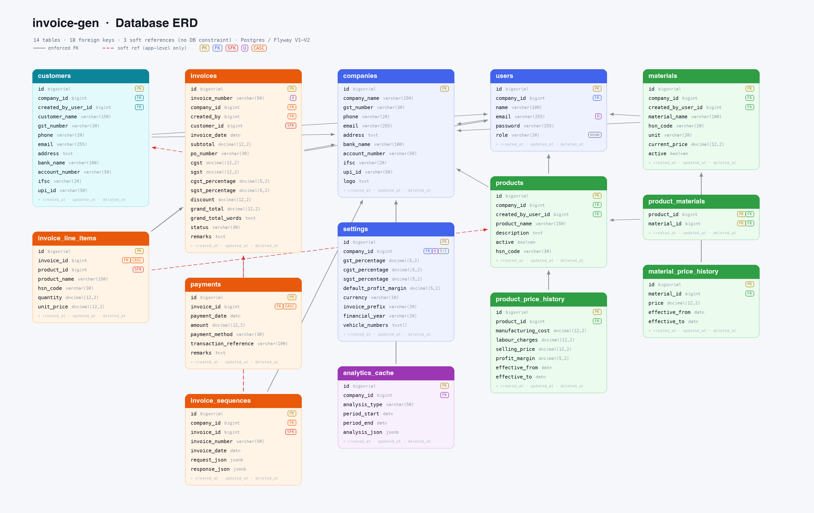

# Database schema

Entity-relationship documentation for the `invoice-gen` Postgres database.

| File | What it is |
|------|-----------|
| [`erd.png`](./erd.png) | Rendered ER diagram — 14 tables, color-coded by domain. |
| [`erd.html`](./erd.html) | Interactive schema browser (open in a browser). Cards + live mermaid diagram. |
| [`erd.excalidraw`](./erd.excalidraw) | Editable source — import at [excalidraw.com](https://excalidraw.com) (menu → Open, or drag-drop). |

## Source of truth

Generated from, and kept in sync with:

- `src/main/resources/db/migration/V1__create_all_basic_tables.sql`
- `src/main/resources/db/migration/V2__add_foreign_key_indexes.sql`
- JPA entities under `com.inv.invmaster001.entity`

## Reading the diagram

- **Solid arrow** = enforced database foreign key.
- **Red dashed arrow** = *soft reference*: the column is a plain `bigint` (mapped `@Column`, not `@ManyToOne`) with **no DB constraint**. Integrity is app-enforced only.
- Column tags: `PK` primary key · `FK` foreign key · `SFK` soft FK · `U` unique · `CASC` `ON DELETE CASCADE` · `enum` free-text holding an enum.
- Every table carries `created_at` / `updated_at` / `deleted_at` (soft delete).

## Key facts

- All rows are tenant-scoped through `companies` (the root).
- `settings.company_id` is `UNIQUE` → one settings row per company (1:1).
- `invoice_line_items` and `payments` cascade-delete with their `invoices`.
- **3 soft references have no FK constraint** — orphans are possible, deletes do not cascade or block:
  - `invoices.customer_id` → `customers.id`
  - `invoice_line_items.product_id` → `products.id`
  - `invoice_sequences.invoice_id` → `invoices.id`
- `invoice_sequences` logs each create request/response as `JSONB` (`request_json`, `response_json`). DTO refactors on those columns need a data migration or the dashboard 400s.
- Quirk: `materials.company_id` is nullable in SQL but `nullable = false` on the entity.

Interactive version (shareable): https://claude.ai/code/artifact/a59fec04-0e99-41c5-ba7e-56ba6459527c
